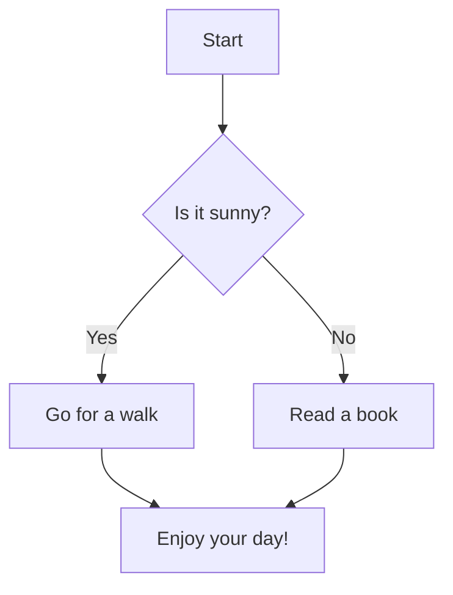
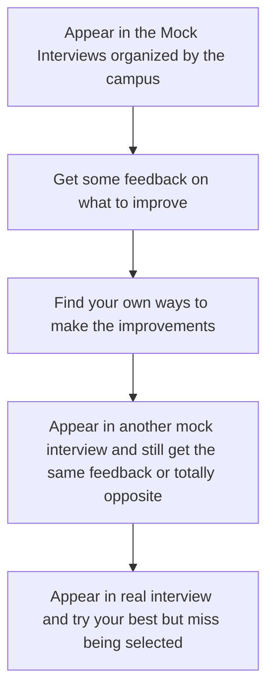
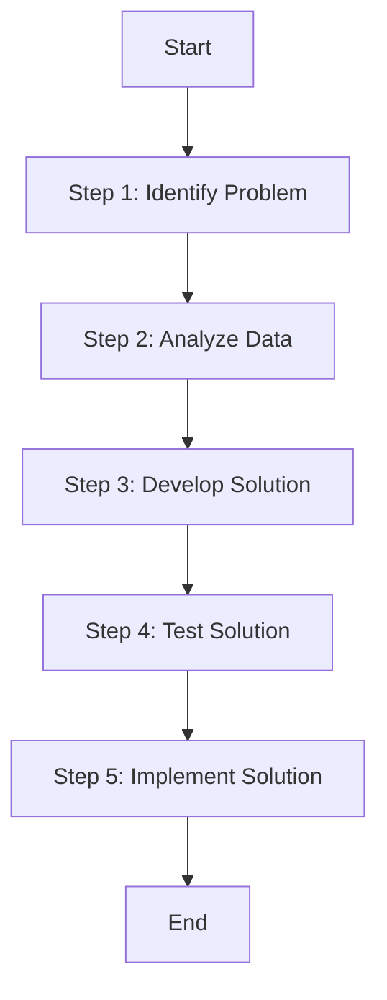
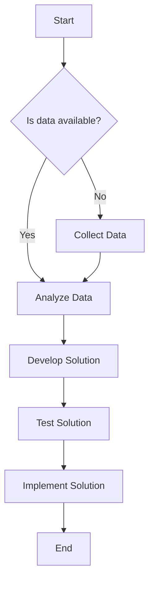

```mermaid
graph TD
Appear in the Mock Interviews
organized by the campus --> Get some feedback on what to
improve --> Find your own ways to make
the improvements -->
Appear in another mock
interview and still get same
feedback or totally opposite -->
Appear in real interview and try
and do your best to find that
you missed being selected
```



### Explanation of the Syntax:
- `graph TD` starts a top-down diagram (`TD` stands for top-down). You can also use `graph LR` for left-to-right layout.
- Each node is defined by a unique label (e.g., `A[Start]`, `B[Step 1: Identify Problem]`).
- The arrows (`-->`) represent the flow or process from one step to the next.
- Each node can have any text you want inside the brackets, which will be displayed as part of the diagram.

### Steps for Creating a Process Flowchart in Mermaid:
1. **Start with `graph TD`**: This initializes the diagram and sets the direction of the flow.
2. **Define Nodes**: Each step in your process is represented as a node, defined by a label inside square brackets (e.g., `[Start]`).
3. **Create Connections**: Use arrows (`-->`) to link the nodes together, indicating the flow of the process.
4. **Subprocesses**: You can also add subgraphs or decision points to your process to represent choices (using `{}` for decision nodes).
  
   Example with a decision point:

```markdown


<p align="center">
  <table>
    <thead>
      <tr>
        <th>Current Process</th>
        <th>Process Effectiveness</th>
      </tr>
    </thead>
    <tbody>
      <tr>
        <td></td>
        <td></td>
      </tr>
      <tr>
        <td></td>
        <td></td>
      </tr>
      <tr>
        <td></td>
        <td></td>
      </tr>
    </tbody>
  </table>
</p>


