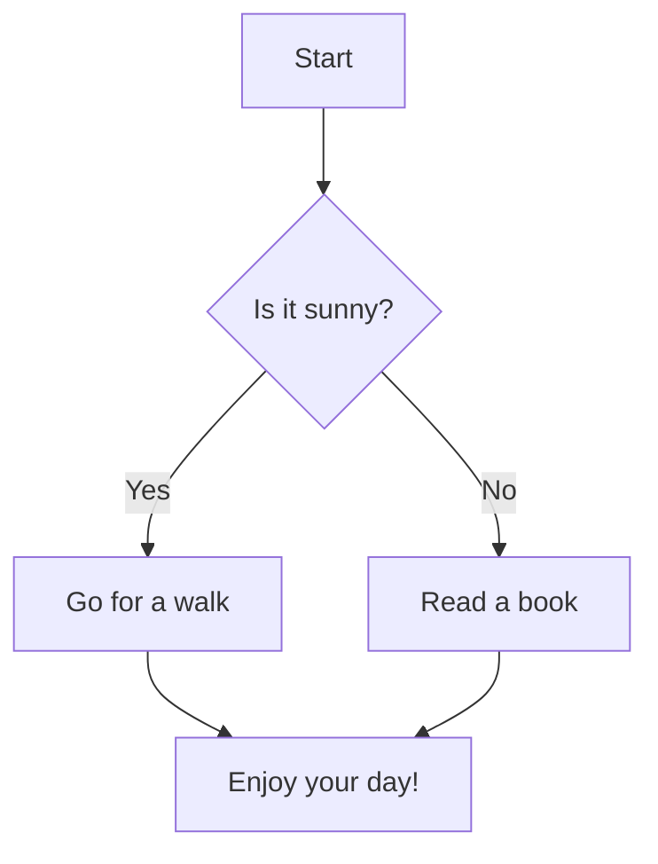
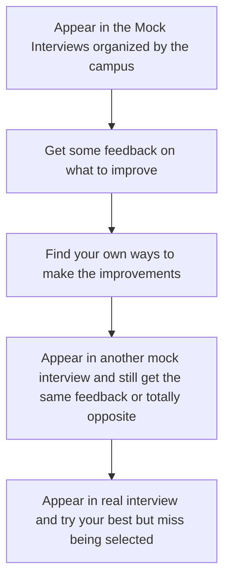

```mermaid
graph TD
Appear in the Mock Interviews
organized by the campus --> Get some feedback on what to
improve --> Find your own ways to make
the improvements -->
Appear in another mock
interview and still get same
feedback or totally opposite -->
Appear in real interview and try
and do your best to find that
you missed being selected
```


