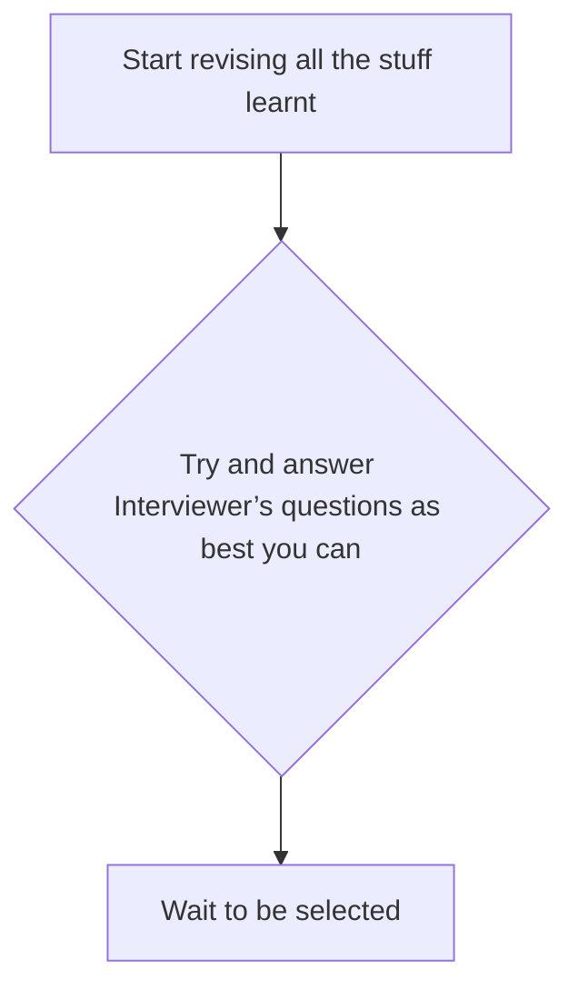
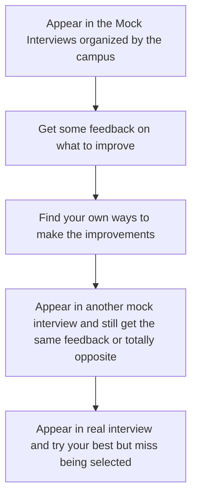
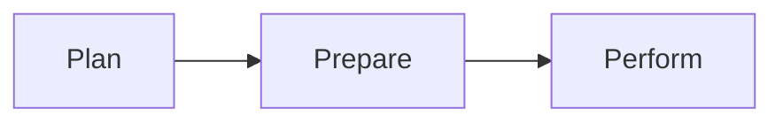

# How to do well in an interview

## Index
- [1_introduction and overview](#1_introduction-and-overview)
   - [Introduction](#introduction)
   - [Current Process Review](#current-process-review)
       - [Current Process](#current-process)
   - [Why not consider a process](#why-not-consider-a-process)
   - [Process Overview to do well](#process-overview-to-do-well)
   - [Introduction and Overview Summary](#introduction-and-overview-summary)
- [2_How to do well in an interview? What to plan and how?](#2_how-to-do-well-in-an-interview-what-to-plan-and-how)
   - [Current Process Review](#current-process-review)
   - [Current Process and its effectiveness](current-process-and-its-effectiveness)
## 1_introduction and overview

## Introduction
The purpose of the module is to give you an
overview about the process that can better help
you do well in your interviews  
At the end of this module you will learn the
following 
+ What process do we use today to do well in an
interview
+ How effective is the current process?
+ Why do we need to consider adapting a new
process?
+ Get an overview of a better process of doing well
in an interview

## Current Process Review
What do you do now to do well in your
interviews and how effective is it?

| Current Process       | Process Effectiveness   |
|-----------------------|-------------------------|
|                       |                         |
|                       |                         |
|                       |                         |

## Current Process

+ You find that you did not get enough time to prepare well
+ What you prepared was not what was asked
+ You did not perform confidently in the interview

## Why not consider a process
<!-- This table will not be rendered -->
<!--  -->

<!-- 

  

 -->

  

+ CAN PROVIDE ENOUGH TIME to prepare well
+ Helps you PREAPRE WHAT WILL BE ASKED
+ Helps you PERFORM CONFIDENTLY in the interview

## Process Overview to do well

## Introduction and Overview Summary

Most of us either
- ➢ start revising all the stuff we have learnt, or
- ➢ if lucky, get opportunities to go through mock interviews.

This process is not very effective for most of us because
- ➢ we don’t get enough time to prepare, and
- ➢ we don’t prepare the right things.

We need to consider adopting a process that can help you
- ➢ prepare the right things, and
- ➢ be ready in time to do well in your interviews.

We have a process that can help you succeed in your interviews by
- ➢ planning the preparation,
- ➢ preparing the right things, and
- ➢ then performing with confidence.

# 2_How to do well in an interview? What to plan and how?

## Current Process Review

What do you do now to plan to do well in your interviews and how effective is it?

| Current Process       | Process Effectiveness     |
|-----------------------|---------------------------|
|                       |                           |
|                       |                           |
|                       |                           |

## Current Process and its effectiveness

Most of us don’t plan properly for doing well in
our interview
+ We start our preparation for the interview as and
when we find time, sometimes just a day or right
ahead of the interview
+ This process in not very effective for most of us
as we don’t get enough time to prepare and
don’t prepare the right things
+ And this lack of planning leads to us being
unprepared and not confident in the interview
+ Leading to us not doing well in the interview

## Why not consider a process that.
+ CAN PROVIDE ENOUGH TIME to prepare well
+ Helps you PREAPRE WHAT WILL BE ASKED
+ Helps you PERFORM CONFIDENTLY in the interview

## What to Plan for an Interview

### How will you reach there physically or connect online?
- **Route to take**
- **Time to start** so that you reach ahead of time
- **Mode of online connection**
  - Phone
  - WhatsApp
  - Zoom, MS Teams, etc.
- **Number or link to connect**
- **Time to connect**

### What will you wear for the interview?
- **Formals vs smart casuals vs casuals**
- **Suit and Tie** vs **No Suit with Tie** vs **No Tie**
- **Specific outfit** to wear

### What do you need to carry or keep with you for the interview?
- CV
- Certificates
- Appointment Letters
- Exhibits

### Things to prepare to do well
- **Topics** to review
- **Types of questions** to anticipate
- **Practice sessions** for preparation

