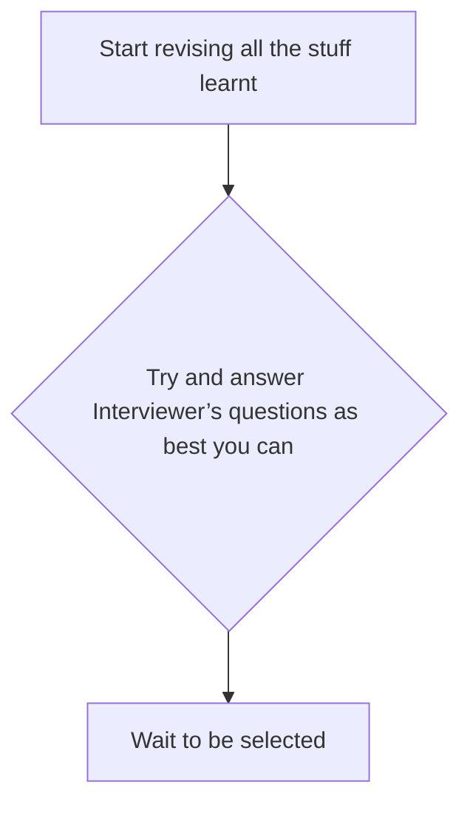
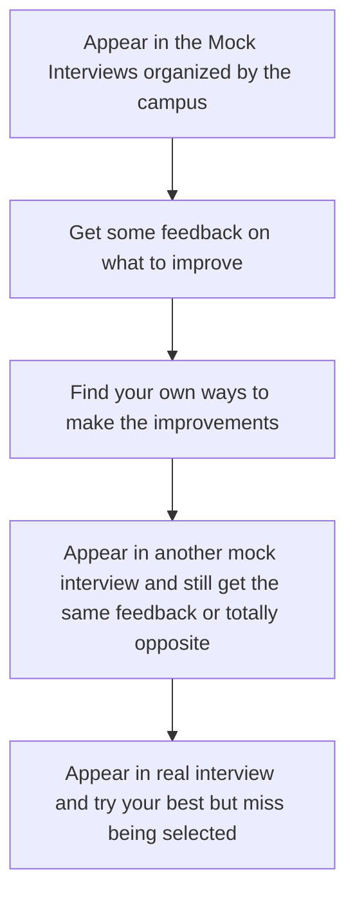
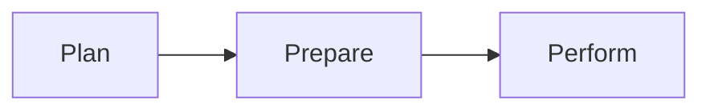
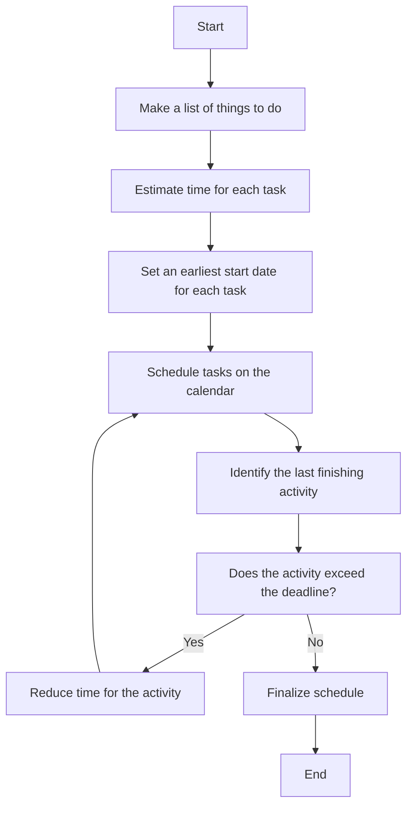

# How to do well in an interview

## Index
- [1_introduction and overview](#1_introduction-and-overview)
   - [Introduction](#introduction)
   - [Current Process Review](#current-process-review)
       - [Current Process](#current-process)
   - [Why not consider a process](#why-not-consider-a-process)
   - [Process Overview to do well](#process-overview-to-do-well)
   - [Introduction and Overview Summary](#introduction-and-overview-summary)
- [2_How to do well in an interview? What to plan and how?](#2_how-to-do-well-in-an-interview-what-to-plan-and-how)
   - [Current Process Review](#current-process-review)
   - [Current Process and its effectiveness](#current-process-and-its-effectiveness)
   - [Why not consider a process that:](#why-not-consider-a-process-that)
   - [What to Plan for an Interview](#what-to-plan-for-an-interview)
     - [How will you reach there physically or connect online?](#how-will-you-reach-there-physically-or-connect-online)
     - [What will you wear for the interview?](#what-will-you-wear-for-the-interview)
     - [What do you need to carry or keep with you for the interview?](#what-do-you-need-to-carry-or-keep-with-you-for-the-interview)
     - [Things to prepare to do well](#things-to-prepare-to-do-well)
 - [3:How to Do Well in Your Interview](#3how-to-do-well-in-your-interview)
     - [How to plan for an interview](#how-to-plan-for-an-interview)
     - [What did we learn in this module](#what-did-we-learn-in-this-module)
     - [Managing Anxiety During the Interview](#managing-anxiety-during-the-interview)
     - 
 
 
## 1_introduction and overview

## Introduction
The purpose of the module is to give you an
overview about the process that can better help
you do well in your interviews  
At the end of this module you will learn the
following 
+ What process do we use today to do well in an
interview
+ How effective is the current process?
+ Why do we need to consider adapting a new
process?
+ Get an overview of a better process of doing well
in an interview

## Current Process Review
What do you do now to do well in your
interviews and how effective is it?

| Current Process       | Process Effectiveness   |
|-----------------------|-------------------------|
|                       |                         |
|                       |                         |
|                       |                         |

## Current Process

+ You find that you did not get enough time to prepare well
+ What you prepared was not what was asked
+ You did not perform confidently in the interview

## Why not consider a process
<!-- This table will not be rendered -->
<!--  -->

<!-- 

  

 -->

  

+ CAN PROVIDE ENOUGH TIME to prepare well
+ Helps you PREAPRE WHAT WILL BE ASKED
+ Helps you PERFORM CONFIDENTLY in the interview

## Process Overview to do well

## Introduction and Overview Summary

Most of us either
- ➢ start revising all the stuff we have learnt, or
- ➢ if lucky, get opportunities to go through mock interviews.

This process is not very effective for most of us because
- ➢ we don’t get enough time to prepare, and
- ➢ we don’t prepare the right things.

We need to consider adopting a process that can help you
- ➢ prepare the right things, and
- ➢ be ready in time to do well in your interviews.

We have a process that can help you succeed in your interviews by
- ➢ planning the preparation,
- ➢ preparing the right things, and
- ➢ then performing with confidence.

# 2_How to do well in an interview? What to plan and how?

## Current Process Review

What do you do now to plan to do well in your interviews and how effective is it?

| Current Process       | Process Effectiveness     |
|-----------------------|---------------------------|
|                       |                           |
|                       |                           |
|                       |                           |

## Current Process and its effectiveness

Most of us don’t plan properly for doing well in
our interview
+ We start our preparation for the interview as and
when we find time, sometimes just a day or right
ahead of the interview
+ This process in not very effective for most of us
as we don’t get enough time to prepare and
don’t prepare the right things
+ And this lack of planning leads to us being
unprepared and not confident in the interview
+ Leading to us not doing well in the interview

## Why not consider a process that:
+ CAN PROVIDE ENOUGH TIME to prepare well
+ Helps you PREAPRE WHAT WILL BE ASKED
+ Helps you PERFORM CONFIDENTLY in the interview

## What to Plan for an Interview

### How will you reach there physically or connect online?
- **Route to take**
- **Time to start** so that you reach ahead of time
- **Mode of online connection**
  - Phone
  - WhatsApp
  - Zoom, MS Teams, etc.
- **Number or link to connect**
- **Time to connect**

### What will you wear for the interview?
- **Formals vs smart casuals vs casuals**
- **Suit and Tie** vs **No Suit with Tie** vs **No Tie**
- **Specific outfit** to wear

### What do you need to carry or keep with you for the interview?
- CV
- Certificates
- Appointment Letters
- Exhibits

### Things to prepare to do well
- **Topics** to review
- **Types of questions** to anticipate
- **Practice sessions** for preparation

## How to plan for an interview

| Activity                    | Time (hrs/days)    | Start Day | Day 1 | Day 2 | Day 3 | Day 4  | Day 5 | Day 6 | Day 7 |
|-----------------------------|--------------------|-----------|-------|-------|-------|--------|-------|-------|-------|
| Update Resume               | 4 hours            | Day 1     | ✅    |       |       |        |       |       |       |
| Review Core DevOps Concepts | 5 days (2 hrs/day) | Day 2     |       | ✅    | ✅    | ✅    | ✅    | ✅    |       |
| Practice Coding Exercises   | 10 days (2 hrs/day)| Day 3     |       | ✅    | ✅    | ✅    | ✅    | ✅    |
| Mock Interviews             | 3 days (1 hr/day)  | Day 6     |       |       |         |       |       | ✅    | ✅    |

## What did we learn in this module
 **Most of us don’t properly plan for an interview;** we may just start preparing a day or night ahead!

 **This process is not very effective** for most of us, as we don’t get enough time to prepare and don’t focus on the right things.

 **We need to consider adopting a process** that helps us prepare the right things in time and approach interviews confidently.

 **We now know the key aspects to plan for,** such as:  
  - How to connect or reach the interview location.  
  - What to wear and carry.  
  - What to prepare and practice.

We also understand how to plan these steps** by creating an **Activity Schedule** to ensure timely and effective preparation, enabling us to feel well-prepared and confident during the interview.
---
# Key Points: Managing Job Interview Anxiety

## Understanding Anxiety
- Anxiety is common during interviews and can vary in levels for different individuals.
- A certain minimum level of anxiety is beneficial as it provides energy to perform.
- Anxiety stems from **expectations about the future** and uncertainty regarding outcomes.

## Pre-Interview Anxiety Management
1. **Understand the Source**:  
   Anxiety arises from high expectations about future events.  
   - Balance expectations: Focus on performing your best, not the outcome.
   - Follow the principle: *Do your duty and let go of the results*.

2. **Preparation is Key**:  
   - Plan thoroughly: Research the job, review the job description, and anticipate questions.  
   - Practice:  
     - Conduct mock interviews.  
     - Prepare answers to common questions.  
   - Aim for readiness to perform anytime.  

3. **Channel Energy**:  
   - Focus your energy on preparation rather than worrying about results.  
   - Avoid overthinking by staying occupied with actionable steps.

## Managing Anxiety During the Interview
1. **Self-Talk for Confidence**:  
   - Remind yourself:  
     - "I have done my best in preparation."  
     - "The outcome is not under my control."  
   - Focus on performing in the moment.

2. **Physical and Mental Alignment**:  
   - Physical activity:  
     - Pace the room to balance mental and physical energy.  
   - Relaxation techniques:  
     - Practice meditation to calm the mind.  
     - Use controlled, deep breathing to slow down and stabilize.

## Long-Term Practices
- **Meditation & Yoga**:  
  - Regular practice helps in controlling thoughts and reducing anxiety.  
- **Mindfulness**:  
  - Develop habits to stay present and reduce overthinking about the future.  

## Additional Resources
- Explore courses on time management and stress management to build long-term resilience.
- Look into tools for meditation and mental focus to maintain calmness in stressful situations.

## Key Takeaway
- Focus on what you can control—preparation and performance.  
- Let go of the results and trust the process.
- Embrace the philosophy: *Do your best and leave the rest to the universe.*

# Module Purpose and Learning Objectives

The purpose of this module is to provide you with an in-depth understanding of how to prepare effectively and perform well in interviews.

## By the end of this module, you will learn:

- **What steps to take now** to prepare for excelling in an interview.
- **How effective** the current preparation process is.
- **Why there is a need** to consider adapting a new preparation process.
- **A better approach** to preparing for successful interviews.
## Current Process Review
What do you do now to prepare to do well in your interviews and how effective is it?
Current Process Process Effectiveness

# 3:How to Do Well in Your Interview

Hello and welcome to this third session of *How to Do Well in Your Interview*, where we'll discuss **what to prepare** and **how to prepare**—a critical part of excelling in interviews.

## Session Overview

### Purpose of the Module:
To provide you with an in-depth understanding of:
- **What to prepare** for interviews.
- **How to prepare** effectively to ensure success.

---

### What You'll Learn:
1. **Assessing Current Preparation**  
   - What do we do today to prepare for interviews?  
   - How effective is the current process?  
2. **Adopting a Better Process**  
   - Why consider a new approach to interview preparation?  
   - What does a better preparation process look like?

---

## What Do We Do Today?

Reflect on your current approach to interview preparation. If needed, pause here, note your thoughts, and continue. Common observations include:  
1. **Lack of Planning:**  
   - Insufficient time allocated for preparation.  
   - Inadequate focus on planning stages.  
2. **Limited Scope of Preparation:**  
   - Overemphasis on CV and common questions like “Tell me about yourself.”  
   - Lack of preparation for deeper or role-specific questions.  
3. **Minimal Practice:**  
   - Rarely practicing responses or seeking feedback.  
   - Leads to overconfidence or underconfidence, depending on personality.

---

## Why Consider a New Process?

A better process helps you:
- Allocate sufficient preparation time.  
- Prepare for all possible questions, including those beyond your CV.  
- Practice effectively to perform with confidence.

---

## How to Prepare for an Interview

### 1. **Prepare for Your Entry**
- If face-to-face:  
  - Plan your greeting, handshake, and opening remarks.  
  - Decide on how to address the interviewer (e.g., Mr./Ms. [Last Name]).  
- If online:  
  - Test audio and video.  
  - Acknowledge confirmations with gratitude.  
  - Prepare for small talk to establish rapport.  

---

### 2. **Introductory Questions**
Key questions to prepare for:
- Tell me about yourself.  
- Why should we hire you?  
- What are your strengths and weaknesses?  

#### Approach:
- Study the **Job Description (JD)** and identify required **Knowledge, Attitude, and Skills (KAS).**  
- Match these to your qualifications and experiences.  
- Highlight 5-6 strong points and structure your answers around them.  
- Practice responses and refine based on feedback.

---

### 3. **Role-Specific and CV-Based Questions**
- Review the JD carefully.  
- Prepare for potential questions about your skills, experiences, and job-relevant scenarios.  
- Anticipate “Tell me more about...” and “What’s not in your CV?” questions.  
- Write concise, bullet-point responses and practice them.

---

### 4. **Closing Questions**
- Examples include:  
  - “Do you have any questions for us?”  
  - “What is your current CTC, and what are your expectations?”  
  - “When can you join us?”  

#### Tips:
- Ask thoughtful, company-focused questions (e.g., “What does it take to be successful here?”).  
- Provide genuine and honest responses to salary and joining date queries.  

---

### 5. **Key Practices**
- **Build Trust:** Be genuine in your answers and acknowledge questions thoughtfully.  
- **Accept Nervousness:** Stay relaxed and confident despite natural nerves.  
- **Feedback Loop:** Regularly practice and improve with feedback from mock interviews.

---

## Recap of Learnings

- Current preparation methods are often limited to CV and common questions.  
- Effective preparation requires addressing role-specific, introductory, and closing questions.  
- Practice, feedback, and mock interviews significantly increase success rates.

---

## What's Next?

In the next session, we will focus on **performance techniques** to ensure you hear the million-dollar question:  
**“When can you join us?”**

---

Thank you for watching this session on *What to Prepare and How to Prepare.* I hope you found it valuable and look forward to guiding you further.

