# How to do well in an interview

## Index
- [Introduction](#introduction)
- [Current Process Review](#current-process-review)
## Introduction
The purpose of the module is to give you an
overview about the process that can better help
you do well in your interviews  
At the end of this module you will learn the
following 
+ What process do we use today to do well in an
interview
+ How effective is the current process?
+ Why do we need to consider adapting a new
process?
+ Get an overview of a better process of doing well
in an interview

## Current Process Review
What do you do now to do well in your
interviews and how effective is it?

| Current Process       | Process Effectiveness   |
|-----------------------|-------------------------|
|                       |                         |
|                       |                         |
|                       |                         |

## Current Process

```mermaid
            graph TD
                A[Start revising all the stuff learnt] --> B{Try and answer Interviewer’s questions as best you can}
                B --> C[Wait to be selected]
```               

    
