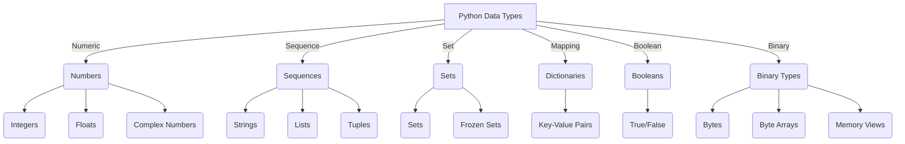

# Flow_Chart

### Explanation
1. **Numbers**: Numeric types include:
   - **Integers** (`int`): Whole numbers (e.g., `10`, `-5`)
   - **Floats** (`float`): Decimal numbers (e.g., `3.14`, `-0.5`)
   - **Complex Numbers** (`complex`): Numbers with real and imaginary parts (e.g., `3+4j`)

2. **Sequences**: Ordered collections of elements:
   - **Strings** (`str`): Text data (`"Hello"`)
   - **Lists** (`list`): Mutable ordered collections (`[1, 2, 3]`)
   - **Tuples** (`tuple`): Immutable ordered collections (`(1, 2, 3)`) 

3. **Sets**: Unordered collections of unique items:
   - **Sets** (`set`): Mutable, unordered collection (`{1, 2, 3}`)
   - **Frozen Sets** (`frozenset`): Immutable version of sets

4. **Dictionaries**: Key-value pairs for mapping (`dict`): 
   - Example: `{"name": "Alice", "age": 25}`

5. **Booleans**: Represent truth values (`bool`): `True` or `False`

6. **Binary Types**: Used for binary data processing:
   - **Bytes** (`bytes`): Immutable sequence of bytes
   - **Byte Arrays** (`bytearray`): Mutable sequence of bytes
   - **Memory Views** (`memoryview`): Efficient memory access to binary data
